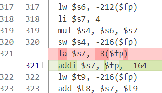

# Lab 4 - 目标代码生成

## 实现的功能

### 1）在存在空闲寄存器的情况下，为变量描述符分配寄存器

参考**不存在空闲寄存器**的情况：该情况下，程序会尝试找一个free并且存放常量的寄存器。如果找到了，那么将该寄存器分配给变量描述符；如果没找到，接着寻找未被使用时间`interval`最大的寄存器，将其分配给变量描述符。

而**存在空闲寄存器**的情况下，不需要替换寄存器。直接将空闲寄存器分配给变量描述符，模仿**不存在空闲寄存器**情况下的后半部分的分配代码。

```c
/*
 * 为变量描述符分配寄存器, load用于指示是否需要装载寄存器，
 * 形如 x = y op z 的表达式中，为x分配寄存器就不需要装载，而为y和z分配时都需要
 */
int allocateReg(VarDes var, FILE *fp, int load)
{
    // 查找是否有空闲寄存器
    int i = 8;
    for (; i < 26; i++)
        if (regs[i]->var == NULL)
            break;
    // 存在空闲寄存器
    if (i >= 8 && i < 26)
    {
        // TODO
        regs[i]->var = var;
        updateInterval(regs[i]);
        if (load == 1)
        {
            // 常量装载到寄存器中
            if (var->op->kind == CONSTANT_OP)
                fprintf(fp, "  li %s, %d\n", regs[i]->name, var->op->value);
            // 将栈中存储的变量的值装载到寄存器中
            else if (var->op->kind == VARIABLE_OP || var->op->kind == TEMP_VAR_OP)
                fprintf(fp, "  lw %s, %d($fp)\n", regs[i]->name, -var->offset);
        }
        return i;
    }
    // 不存在空闲寄存器
    else if (i == 26)
    {
        // 最长时间未使用算法
        // 先尝试找到一个free并且存放常量的寄存器
        for (i = 8; i < 26; i++)
            if (regs[i]->free == 1 && regs[i]->var->op->kind == CONSTANT_OP)
                break;
        // 然后找interval最大的那个寄存器
        if (i == 26)
        {
            int max = 0;
            int res = 8;
            for (i = 8; i < 26; i++)
                if (regs[i]->free == 1 && regs[i]->interval >= max)
                {
                    max = regs[i]->interval;
                    res = i;
                }
            i = res;
        }
        regs[i]->var = var;
        updateInterval(regs[i]);
        // var->regNo = i;
        if (load == 1)
        {
            // 常量装载到寄存器中
            if (var->op->kind == CONSTANT_OP)
                fprintf(fp, "  li %s, %d\n", regs[i]->name, var->op->value);
            // 将栈中存储的变量的值装载到寄存器中
            else if (var->op->kind == VARIABLE_OP || var->op->kind == TEMP_VAR_OP)
                fprintf(fp, "  lw %s, %d($fp)\n", regs[i]->name, -var->offset);
        }
        return i;
    }
}
```

### 2）地址操作数的装载

自己试出了一种能通过self_test.cmm的做法。

首先获取空闲寄存器，但不要装载，也不要用`getReg`函数中变量描述符的偏移量。将`getReg`的第三个参数`load`设置为0，获取到空闲寄存器后，将相对于帧指针（$fp）的偏移量为-8的地址加载到该寄存器中。

至于为什么偏移量是-8，我也不知道。 :innocent: （试了三个星期，也不知道对不对）

```c
// 根据操作数的类型完成装载
int handleOp(Operand op, FILE *fp, int load)
{
    if (op->kind == VARIABLE_OP || op->kind == TEMP_VAR_OP || op->kind == CONSTANT_OP)
        return getReg(op, fp, load);
    else if (op->kind == GET_VAL_OP)
    {
        int reg = getReg(op->opr, fp, load);
        fprintf(fp, "  lw %s, 0(%s)\n", regs[reg]->name, regs[reg]->name);
        return reg;
    }
    else if (op->kind == GET_ADDR_OP)
    {
        // TODO
        int reg = getReg(op->opr, fp, 0);
        fprintf(fp, "  la %s, %d($fp)\n", regs[reg]->name, -8);
        return reg;
    }
}
```

另一种做法，获取空闲寄存器时依旧不装载（实际上装载与否，该寄存器都会被`addi`指令覆盖掉），将帧指针（$fp）减去变量描述符的偏移量即可。

```c
    else if (op->kind == GET_ADDR_OP)
    {
        // TODO
        // int reg = getReg(op->opr, fp, 0);
        // fprintf(fp, "  la %s, %d($fp)\n", regs[reg]->name, -8);
        // return reg;
        int reg = getReg(op->opr, fp, 0);
        FrameDes frame = findCurrFrame();
        VarDes var = createVarDes(op->opr, frame);
        fprintf(fp, "  addi %s, $fp, %d\n", regs[reg]->name, -var->offset);
        return reg;
    }
```

两种做法生成的汇编代码不同之处在于：



能通过测试的代码就是好代码。

### 3）ASSIGN_IR

参考`PLUS_IR`的代码，赋值指令与加法指令的区别就在于：赋值指令的右操作数只有一个。使用`move`指令替换`add`指令。

```c
        case ASSIGN_IR:
        {
            // TODO
            Operand left = curr->ops[0];
            Operand right = curr->ops[1];
            int regRight = handleOp(right, fp, 1);
            if (left->kind == VARIABLE_OP || left->kind == TEMP_VAR_OP)
            {
                int regLeft = getReg(left, fp, 0);
                fprintf(fp, "  move %s, %s\n", regs[regLeft]->name, regs[regRight]->name);
                spillReg(regs[regLeft], fp);
            }
            else if (left->kind == GET_VAL_OP)
            {
                int regLeft1 = getReg(left->opr, fp, 0);
                fprintf(fp, "  move %s, %s\n", regs[regLeft1]->name, regs[regRight]->name);
                int regLeft2 = getReg(left->opr, fp, 1);
                fprintf(fp, "  sw %s, 0(%s)\n", regs[regLeft1]->name, regs[regLeft2]->name);
            }
            break;
        }
```

### 4）SUB_IR

参考`PLUS_IR`的代码，将`add`指令替换成`sub`指令。

```c
        case SUB_IR:
        {
            // TODO
            Operand left = curr->ops[0];
            Operand right1 = curr->ops[1];
            Operand right2 = curr->ops[2];
            int regRight1 = handleOp(right1, fp, 1);
            int regRight2 = handleOp(right2, fp, 1);
            if (left->kind == VARIABLE_OP || left->kind == TEMP_VAR_OP)
            {
                int regLeft = getReg(left, fp, 0);
                fprintf(fp, "  sub %s, %s, %s\n", regs[regLeft]->name, regs[regRight1]->name, regs[regRight2]->name);
                spillReg(regs[regLeft], fp);
            }
            else if (left->kind == GET_VAL_OP)
            {
                int regLeft1 = getReg(left->opr, fp, 0);
                fprintf(fp, "  sub %s, %s, %s\n", regs[regLeft1]->name, regs[regRight1]->name, regs[regRight2]->name);
                int regLeft2 = getReg(left->opr, fp, 1);
                fprintf(fp, "  sw %s, 0(%s)\n", regs[regLeft1]->name, regs[regLeft2]->name);
            }
            break;
        }
```

### 5）DIV_IR

参考`MUL_IR`的代码，将`mul`指令替换成`div`指令。

```c
        case DIV_IR:
        {
            // TODO
            Operand left = curr->ops[0];
            Operand right1 = curr->ops[1];
            Operand right2 = curr->ops[2];
            int regRight1 = handleOp(right1, fp, 1);
            int regRight2 = handleOp(right2, fp, 1);
            if (left->kind == VARIABLE_OP || left->kind == TEMP_VAR_OP)
            {
                int regLeft = getReg(left, fp, 0);
                fprintf(fp, "  div %s, %s, %s\n", regs[regLeft]->name, regs[regRight1]->name, regs[regRight2]->name);
                spillReg(regs[regLeft], fp);
            }
            else if (left->kind == GET_VAL_OP)
            {
                int regLeft1 = getReg(left->opr, fp, 0);
                fprintf(fp, "  div %s, %s, %s\n", regs[regLeft1]->name, regs[regRight1]->name, regs[regRight2]->name);
                int regLeft2 = getReg(left->opr, fp, 1);
                fprintf(fp, "  sw %s, 0(%s)\n", regs[regLeft1]->name, regs[regLeft2]->name);
            }
            break;
        }
```

## 如何编译

### 编译

在Makefile所在文件夹下，即Code文件夹下执行，在Result文件夹中生成.s汇编代码文件。

```bash
make test
```

### 测试

同时，添加了批量测试的命令。

```makefile
spim-test:
	@echo "Test test1.cmm"
	echo "7" | spim -file ../Result/out1.s
	@echo "----------------------------------------"
	@echo "Test test2.cmm"
	echo "7" | spim -file ../Result/out2.s
	@echo "----------------------------------------"
	@echo "Test self_test.cmm"
	spim -file ../Result/self_out.s
```

同样地，在Code文件夹下执行，批量测试输入为7时，两个必做样例的输出结果，以及一个自测试样例的输出结果。

```bash
make spim-test
```

## 结果

两个必做样例的输入均为7。显示其它数字是因为没有对齐，实际上是输出。

```
Test test1.cmm
echo "7" | spim -file ../Result/out1.s
SPIM Version 8.0 of January 8, 2010
Copyright 1990-2010, James R. Larus.
All Rights Reserved.
See the file README for a full copyright notice.
Loaded: /usr/lib/spim/exceptions.s
Enter an integer:1
1
2
3
5
8
13
----------------------------------------
Test test2.cmm
echo "7" | spim -file ../Result/out2.s
SPIM Version 8.0 of January 8, 2010
Copyright 1990-2010, James R. Larus.
All Rights Reserved.
See the file README for a full copyright notice.
Loaded: /usr/lib/spim/exceptions.s
Enter an integer:5040
----------------------------------------
Test self_test.cmm
spim -file ../Result/self_out.s
SPIM Version 8.0 of January 8, 2010
Copyright 1990-2010, James R. Larus.
All Rights Reserved.
See the file README for a full copyright notice.
Loaded: /usr/lib/spim/exceptions.s
130
112
66
```


